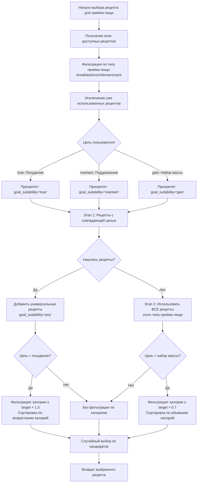
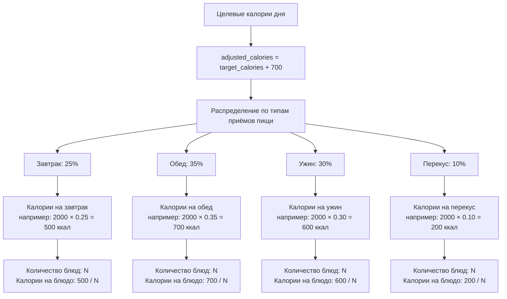
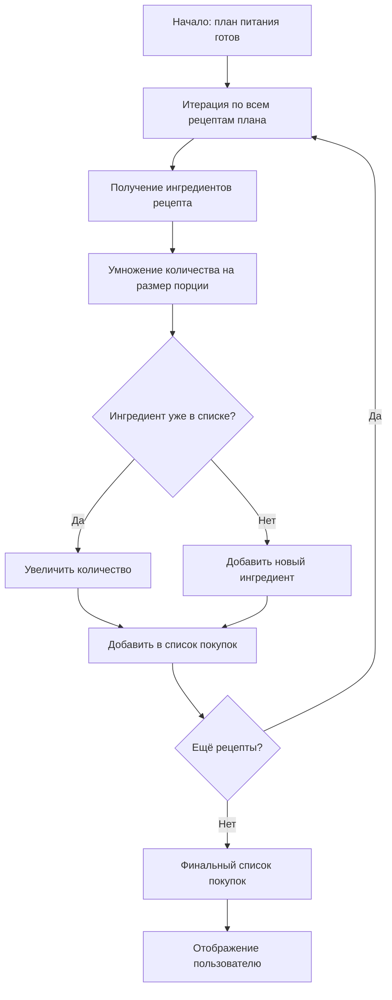
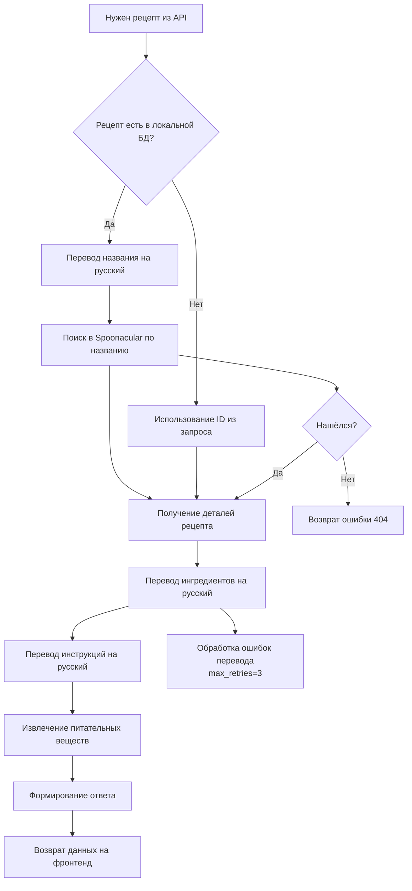

# Блок-схема: Процесс составления рациона питания

## 1. Высокоуровневая схема всего процесса

```mermaid
flowchart TD
    A[Начало] --> B[Авторизация/Регистрация пользователя]
    B --> C[Вход в раздел 'План питания']
    C --> D{У пользователя есть<br/>настройки по умолчанию?}
    
    D -->|Да| E[Загрузка настроек:<br/>- Целевая калорийность<br/>- Цель: похудение/поддержание/набор<br/>- Бюджет: эконом/средний/премиум]
    D -->|Нет| F[Использовать значения по умолчанию<br/>2000 ккал, поддерживание, средний бюджет]
    
    E --> G[Пользователь может изменить параметры]
    F --> G
    
    G --> H[Указание предпочтений:<br/>- Любимые ингредиенты<br/>- Исключаемые ингредиенты]
    H --> I[Настройка приёма пищи:<br/>- Типы: завтрак/обед/ужин/перекус<br/>- Количество блюд на тип]
    I --> J[Нажатие 'Сгенерировать рацион']
    
    J --> K{Генерация плана}
    K --> L[Фильтрация рецептов по бюджету]
    L --> M[Исключение рецептов с<br/>нежелательными ингредиентами]
    M --> N[Распределение калорий по приёмам пищи]
    
    N --> O[Для каждого типа приёма пищи:<br/>- Расчёт целевых калорий<br/>- Подбор подходящих рецептов<br/>- Учёт цели пользователя]
    
    O --> P{Рецепты найдены?}
    P -->|Да| Q[Формирование недельного плана]
    P -->|Нет| R[Использование fallback-стратегии:<br/>- Универсальные рецепты<br/>- Любые доступные рецепты]
    R --> Q
    
    Q --> S[Отображение плана пользователю]
    S --> T{Пользователь доволен?}
    
    T -->|Да| U[Сохранение плана в БД]
    T -->|Нет| V[Перегенерация с теми же<br/>или изменёнными параметрами]
    V --> K
    
    U --> W[Генерация списка покупок]
    W --> X[Конец: план сохранён,<br/>список покупок готов]
```

---

## 2. Детальная схема: Алгоритм выбора рецепта

---

## 3. Схема: Распределение калорий по приёмам пищи

---

## 4. Схема: Генерация списка покупок

---

## 5. Схема: Взаимодействие с API Spoonacular

---

## Ключевые компоненты системы:

1. **MealPlan** — модель плана питания пользователя
2. **MealPlanItem** — отдельные приёмы пищи в плане
3. **Recipes** — база рецептов с метаданными
4. **UserPreference** — предпочтения пользователя по ингредиентам
5. **UserSettings** — настройки по умолчанию
6. **ShoppingList** — список покупок
7. **generate_meal_plan** — основной алгоритм генерации
8. **_select_recipe_for_meal** — выбор рецепта для приёма пищи
9. **generate_shopping_list** — формирование списка покупок
